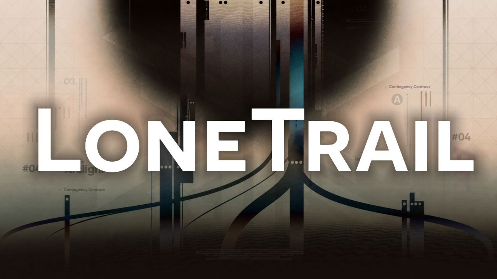

# Lonetrail

<p align="center">
  
</p>


English | [简体中文](README-zhCN.md)

A minimal Astro blog template. Clean, fast, fully configurable via YAML.

## Demo

👉[Live Demo Here!](https://lonetrail.vercel.app/)


## Features

- **Astro v6** — Island architecture, zero JS by default
- **React 19** — Interactive components when needed
- **Tailwind CSS 4** — Utility-first styling
- **Full-text archive** — Searchable post listing
- **Categories & tags** — Taxonomy-based organization
- **Series support** — Group posts into series
- **i18n** — zh-CN, zh-TW, English
- **KaTeX** — Math formula rendering
- **Mermaid** — Diagram support
- **Expressive code** — Syntax highlighting with themes
- **PostHog analytics** — Optional, configurable
- **RSS / Atom / Sitemap** — Auto-generated feeds
- **Dark mode** — Built-in theme switching
- **Responsive** — Mobile-first, desktop optimized

## Quick Start

```bash
pnpm install
pnpm dev       # http://localhost:4321
pnpm build     # Output: dist/
```

## Configuration

All site settings in `src/site.yml`:

```yaml
site:
  title: "Your Blog"
  subtitle: "A place to share your thoughts"
  url: "https://your-site.com"
  author: "Your Name"
```

Toggle features on/off:

```yaml
features:
  comments: false
  donate: false
  series: true
```

## Content

Create posts in `src/content/posts/`:

```markdown
---
title: "My First Post"
published: 2025-01-01
tags: ["astro", "blog"]
category: "tech"
---

Content here...
```

Additional content types:
- `src/content/seri/` — Series
- `src/content/spec/` — Standalone pages
- `src/data/links.yml` — Friend links
- `src/data/essays.yml` — Micro-blog posts
- `src/data/photos.yml` — Gallery

## Deploy

```bash
pnpm build     # Generates dist/
```

Static output — deploy to Cloudflare Pages, Vercel, Netlify, or any static host.

## Structure

```
src/
  config.ts        Site config (YAML-driven)
  site.yml         All settings
  content/         Posts, series, specs
  components/      UI & page components
  layouts/         Page layouts
  pages/           Routes
  styles/          CSS tokens & themes
  plugins/         Remark/rehype plugins
  i18n/            Translations
public/            Static assets
```

## License

MIT — use freely, no attribution required.
